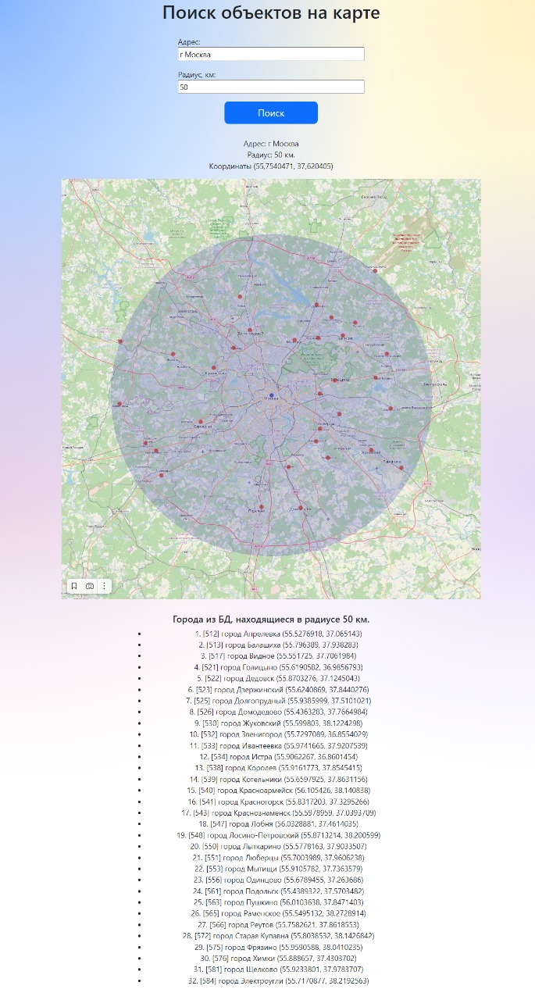

# Тестовое задание

## кандидат: Александр Бойко

### Примечание

При реализации асинхронной загрузки тайлов сервер выдает ошибку

     Access denied. See https://operations.osmfoundation.org/policies/tiles/

Асинхронный код закоментирован, вернулся к синхронному

---

### 1. Клонируем репозиторий

```
   $ git clone git@github.com:Kikoma/fgsTest.git
``` 

### 2. Задаем первоначальные настройки файла ___.env_prod___

Образец файла настроек ___.env_example___

      # Настройки Django
      DEBUG=False
      SECRET_KEY=django-insec.................
      # Настройки базы данных
      DB_HOST=127.0.0.1
      DB_HOST2=127.0.0.1
      DB_PORT=5432
      DB_NAME=db_dbname
      DB_USER=db_username
      DB_PASS=db_user_password
      
      ALLOWED_HOSTS=127.0.0.1,localhost
      
      CORS_ALLOW_ALL_ORIGINS=True
      
      CSRF_TRUSTED_ORIGINS =http://127.0.0.1, localhost
      
      # Доступ к API dadata
      DADATA_API_KEY=xxx
      DADATA_SECRET_KEY=xxx

### 3. Строим и запускаем все контейнеры

Обязательно указываем файл .env_prod

   ```
   $ docker-compose up --build -d --env-file .env_prod
   ```

### 4. Загружаем файл city.csv

Команда прописана в docker и при запуске docker-compose выполняется автоматически. Если надо выполнить вручную, то
выполняем:

   ```
   $ python manage.py importcity
   ```

## Результат работы



### P.S.

> **в планах сделать:**
> 1. тесты
> 2. ~~Скачивание тэйлов запускать в ___асинхронном режиме (aiohttp)___~~ - __Сделано__
> 3. Запустить celery на удаление старых файлов карт (раз в сутки)
> 4. Оптимизировать карту (масштаб тэйлов, центрирование карты по центральной точке)
> 5. проверить/добавить/исправить формирование логов
>
> Есть ограничения по времени, поэтому буду доделывать по возможности 😎
> 
